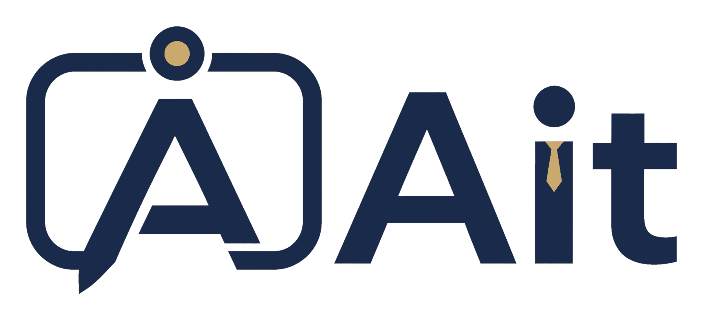
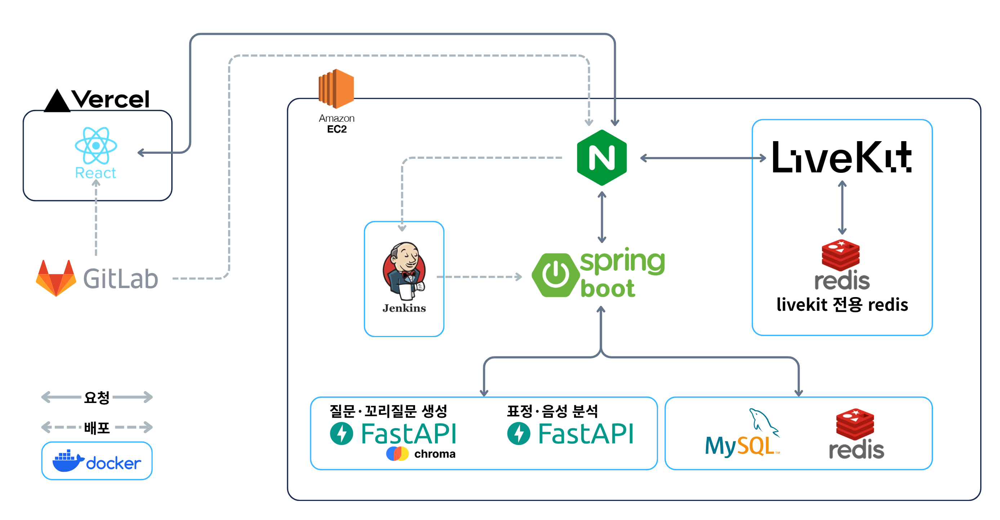
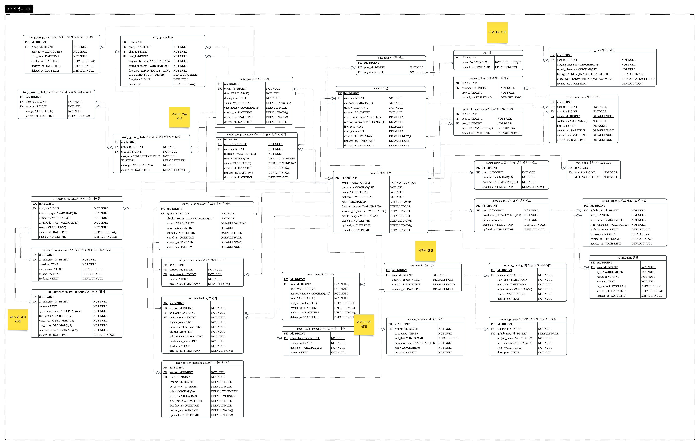

<h1 align="center"> Ait : AI 모의 면접 & 면접 스터디 플랫폼 </h1>

  

 

## 프로젝트 소개

**"효율적인 면접 준비를 위한 올인원 플랫폼"**

Ait(AI Interview Trainer)는 이력서·자기소개서·GitHub 기반 맞춤형 AI 모의 면접과 실시간 화상 스터디를 제공하는 개발자 전용 면접 플랫폼입니다.

### 개발 배경 및 필요성

- **기능의 파편화**: 기존 면접 스터디는 모집, 연습, 평가, 커뮤니케이션이 분리되어 있어 진행 과정이 비효율적입니다.
- **기존 AI 모의 면접의 한계**: 개인 이력서는 분석하지만, GitHub를 연동한 깊이 있는 질문 생성에는 한계가 있습니다.
- **면접 컨설팅의 한계**: 비용 부담이 크고 예약 및 시간 제약이 있어, 충분히 반복 연습하기 어렵습니다.

이러한 문제들을 해결하기 위해 지원자의 개인 데이터를 반영하는 AI 면접관과 스터디 협업 기능을 결합한 Ait를 개발했습니다.

### 주요 기능

- **개인화된 RAG 기반 질문 생성**: 지원자의 이력서, 자기소개서, GitHub 데이터를 기반으로 질문을 생성합니다. (면접 유형별 참고 문서 비중 차등 적용)
- **동적 꼬리 질문 시스템**: 루브릭 채점 방식을 적용하여 답변과 비교하여 기준 미충족 시 꼬리 질문을 진행합니다.
- **맞춤형 면접관 페르소나**: 편안함, 실전, 압박 등 면접관 어조를 선택해 다양한 면접 환경을 훈련할 수 있습니다.
- **실시간 화상 스터디룸**: LiveKit 기반 화상 스터디, 그룹 채팅, 자료실, 스터디원 간 평가 기능을 제공합니다.

### 기대 효과

- **면접 준비의 고도화 및 효율화**: 실제 제출 서류 기반 질문을 통해 개인화된 면접 대비가 가능합니다.
- **답변 논리성 강화**: 꼬리 질문 시스템을 통해 답변의 허점을 스스로 보완하는 능력을 배양합니다.
- **스터디 운영 비용 절감**: 일정 관리, 자료 공유, 화상 면접, 피드백 관리를 단일 플랫폼에서 진행합니다.

 

## 기술 스택

- **Frontend**: React 19, TypeScript, Vite, Tailwind CSS v4, shadcn/ui, React Router
- **Backend**: Java 21, Spring Boot 4, Spring Security, JPA, QueryDSL, MySQL 8, Redis 7, WebSocket, SSE, LiveKit, Gradle
- **AI**: FastAPI, ChromaDB, RAG, Celery, Redis
- **Infrastructure**: AWS EC2, Docker, Vercel

 

## 시스템 구성도

 

## ERD

## 팀 소개

|  이름  |    역할     |
| :----: | :---------: |
| 박승진 | Leader / BE |
| 정현진 |     FE      |
| 박성현 |     BE      |
| 이진웅 |     FE      |
| 김동현 |     AI      |
| 김민범 |     BE      |
